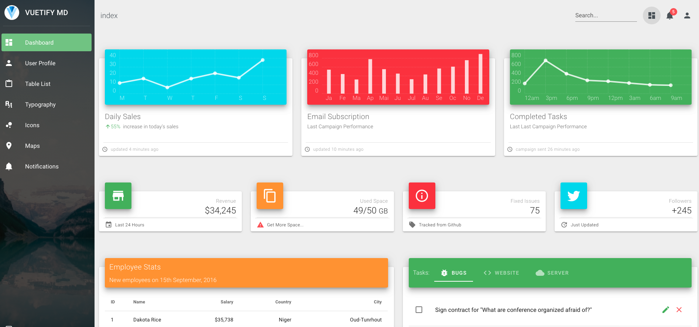

# vuetify-nuxt-material-dashboard

> Nuxt.js + Vuetify.js + Material Dashboard



## Main technologies used

- [Vuetify.js](https://vuetifyjs.com/)
- [Nuxt.js](https://github.com/nuxt/nuxt.js)
- [Material-dashboard](https://demos.creative-tim.com/material-dashboard/docs/2.1/getting-started/introduction.html)

## Build Setup

```bash
# install dependencies
$ npm install # Or yarn install

# install babel 7 (optional)
$ npm install --save-dev @babel/core @babel/preset-env

# serve with hot reload at localhost:3000
$ npm run dev

# build for production and launch server
$ npm run build
$ npm start

# generate static project
$ npm run generate
```
